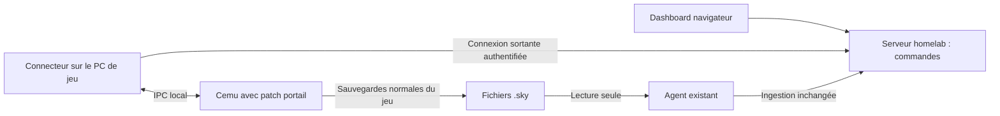

# Contrôler le portail Cemu depuis le dashboard

Recherche du 12 septembre 2026. **Plan historique.** Une implémentation Linux v1 est maintenant décrite dans [CEMU-PORTAL.md](CEMU-PORTAL.md). Les constats « ce qui existe » ci-dessous décrivent la situation avant ce patch ; les validations effectives sont consignées séparément.

## Conclusion

Le contrôle est réalisable. La piste recommandée est un petit patch Cemu exposant un protocole local, accompagné d’un connecteur sur le PC de jeu. Un fork sert à développer et tester ce patch ; l’objectif est une contribution amont pour réduire la maintenance. L’acceptation par Cemu n’est pas acquise.

Je n’ai trouvé aucun contrat public de contrôle distant du portail dans les sources examinées. Les options de lancement examinées ne proposent pas de commande pour poser ou retirer une figurine dans une instance en cours. Ce constat porte sur le commit étudié, pas sur tous les forks existants. [Options de lancement Cemu](https://github.com/cemu-project/Cemu/blob/3310f3b8b184d64a62b89fd59088c799432badf5/src/config/LaunchSettings.cpp).

## Ce qui existe

Dans ce projet, `PortalService` persiste une disposition et `portal.js` la synchronise entre fenêtres du navigateur. Il n’y a ni connexion à Cemu, ni accusé de réception de l’émulateur. Ne pas confondre cette disposition avec les figurines effectivement chargées.

Dans Cemu, la fenêtre USB appelle `LoadSkylanderPath`, puis `g_skyportal.LoadSkylander`. Elle conserve une correspondance entre ligne graphique et emplacement interne, utilisée par `ClearSkylander`. Il faudra partager cette logique avec le pont pour maintenir l’interface native à jour. [Fenêtre USB Cemu](https://github.com/cemu-project/Cemu/blob/3310f3b8b184d64a62b89fd59088c799432badf5/src/gui/wxgui/EmulatedUSBDevices/EmulatedUSBDeviceFrame.cpp#L270-L329).

Le moteur possède 16 emplacements internes. `LoadSkylander` choisit un emplacement et renvoie `0xFF` si aucun n’est disponible. `RemoveSkylander` sauvegarde avant de fermer le fichier. Les mutations utilisent un mutex et des transitions de statut. **La grille 9 + piège du dashboard ne correspond donc pas directement aux indices Cemu**, et 16 emplacements ne signifie pas 16 personnages jouables simultanément. [Déclarations du portail](https://github.com/cemu-project/Cemu/blob/3310f3b8b184d64a62b89fd59088c799432badf5/src/Cafe/OS/libs/nsyshid/Skylander.h), [implémentation](https://github.com/cemu-project/Cemu/blob/3310f3b8b184d64a62b89fd59088c799432badf5/src/Cafe/OS/libs/nsyshid/Skylander.cpp#L818-L878).

## Options

| Solution | Intérêt | Limite | Décision proposée |
| --- | --- | --- | --- |
| Automatiser les clics de Cemu | Démonstration sans compiler | Dépend du focus, des fenêtres, de la langue et de l’environnement graphique ; retour d’état fragile | Prototype jetable seulement |
| Patch Cemu avec IPC local | Commandes explicites, état réel, erreurs exploitables | Compilation et entretien du patch | Recommandé |
| Émuler un périphérique USB externe | Pourrait éviter le patch dans certains environnements | Pilotes, permissions, portabilité et protocole complet à prendre en charge | Trop coûteux pour le MVP |

L’existence d’un portail émulé intégré est documentée dans la [FAQ officielle Cemu](https://wiki.cemu.info/wiki/Skylanders_Portal_FAQ). Le navigateur ne peut pas appeler directement ses méthodes C++.

## Architecture proposée

Le connecteur interroge le serveur ou maintient une connexion sortante ; le serveur n’accède jamais au disque du PC. Le téléphone continue à communiquer uniquement avec le homelab. Cela évite de faire dépendre le produit d’une connexion du navigateur à `localhost` sur le PC de jeu.

**Évolution d’architecture à documenter avant réalisation :** `CLAUDE.md` et `SPEC.md` décrivent actuellement un seul flux agent → serveur. Le pont introduira des commandes dans le sens retour, sur un canal séparé. L’agent d’ingestion conserve sa fonction et son interdiction d’écrire. Cemu reste responsable des écritures normales du jeu ; le pont n’édite, ne crée, ne renomme et ne supprime aucun dump. Aucun fichier source n’a été modifié pour cette étude.

## Livraison par étapes

### 1. Valider un prototype local

- Relever la version de Cemu réellement utilisée, l’OS, l’environnement graphique et le jeu cible. Commencer par Trap Team.
- Créer une branche de travail Cemu sur un commit épinglé et établir un build reproductible.
- Extraire un service de portail partagé par la fenêtre USB et le futur endpoint IPC : chargement, retrait, lecture d’état. Ne pas invoquer une boîte de dialogue depuis le thread réseau.
- Définir le contexte d’exécution des mutations, sérialiser les commandes, protéger la lecture d’état et respecter les transitions existantes. Valider les indices avant toute entrée dans le moteur.
- Tester le chargement puis le retrait depuis un client local minimal. Comparer avec les boutons natifs, y compris un changement effectué depuis Cemu.

**Sortie :** une figurine est détectée et retirée en jeu ; l’état du client et de Cemu converge. Tester avec des copies de travail dédiées, créées explicitement hors du dossier source, avant toute utilisation des sauvegardes habituelles.

### 2. Définir le contrat et les identités

Contrat proposé, non existant : `getCapabilities`, `getState`, `loadFigure`, `removeFigure`. Reporter `clearAll` et le remplacement multiple après le MVP.

Chaque commande porte `commandId`, `connectionEpoch`, `expectedRevision`, `fileId` et, selon l’action, un emplacement logique. La réponse contient l’état observé, sa révision, l’emplacement réellement attribué et une erreur structurée éventuelle. La disponibilité doit distinguer Cemu fermé, pont absent, portail désactivé et portail prêt.

Le couple toy ID / variant ID identifie un modèle, pas nécessairement le fichier à ouvrir : plusieurs jeux ou copies peuvent partager cette identité. Faire sélectionner un fichier précis côté serveur, puis le référencer par un identifiant opaque. Le connecteur associe cet identifiant à un chemin local autorisé. Aucun chemin arbitraire fourni par le navigateur, aucune résolution par le seul nom français, aucun déplacement de parsing vers l’agent.

**Sortie :** sélection non ambiguë entre deux dumps du même modèle, erreurs de fichier absent, portail plein ou version incompatible correctement remontées.

### 3. Relier le homelab et le PC

- Ajouter un connecteur séparé, optionnel, activé explicitement, avec configuration hors du dossier `.sky`.
- IPC Cemu par socket Unix avec permissions utilisateur sur Linux ; envisager un named pipe Windows ensuite. Si TCP est retenu, boucle locale uniquement avec authentification.
- Authentifier la connexion sortante au homelab et les mutations du navigateur ; ne pas réutiliser implicitement le secret d’ingestion pour le contrôle.
- Limiter les fichiers à la racine configurée après résolution des liens symboliques. Refuser traversées de chemins, formats et tailles invalides.
- Expirer rapidement les commandes et les rattacher à la session de connexion. Après une coupure, relire l’état réel : ne jamais rejouer une ancienne pose à la reconnexion.
- Dédupliquer les retries par `commandId` ; une commande reçue n’est pas nécessairement une commande appliquée. Après un timeout ambigu, réconcilier avant une nouvelle action.

**Sortie :** une action depuis le téléphone atteint Cemu, ou affiche une erreur explicite ; une action expirée ne s’exécute pas plus tard.

### 4. Brancher l’interface

- Conserver la disposition préparée séparément de l’état observé de Cemu.
- Présenter « Local », « Connexion en cours », « Connecté à Cemu », « Indisponible » selon les capacités remontées.
- Afficher l’attente pendant une commande et valider la pose seulement à réception de l’état confirmé. Ne pas changer `unlocked` depuis le portail.
- Refléter également les actions effectuées dans Cemu. Faire dépendre les slots des capacités du pont ; tester explicitement pièges, Swap Force et véhicules avant d’annoncer leur prise en charge.
- Laisser les nouvelles statistiques suivre le chemin normal Cemu → fichier → agent → ingestion → UI.

**Sortie :** deux fenêtres et un téléphone montrent le même état confirmé ; aucun échec ne ressemble à une réussite.

### 5. Stabiliser et réduire la maintenance

Valider chargement/retrait répétés, remplacement, double clic, accès concurrent depuis Cemu, déconnexion pendant une commande, redémarrage, portail plein, fichier absent, dump invalide et erreur d’écriture de Cemu. Ne pas promettre un remplacement atomique tant qu’il n’est pas implémenté et testé.

Vérifier l’intégrité des copies de test et l’ingestion finale après une vraie partie. Fournir un interrupteur désactivant le pont et un retour au Cemu officiel. Soumettre ensuite une proposition amont limitée au contrôle du portail, avec protocole versionné et documentation de build.

**Priorité immédiate : étape 1.** Le prototype local doit prouver la synchronisation avec la fenêtre USB et le jeu avant tout chantier serveur ou migration de base.
