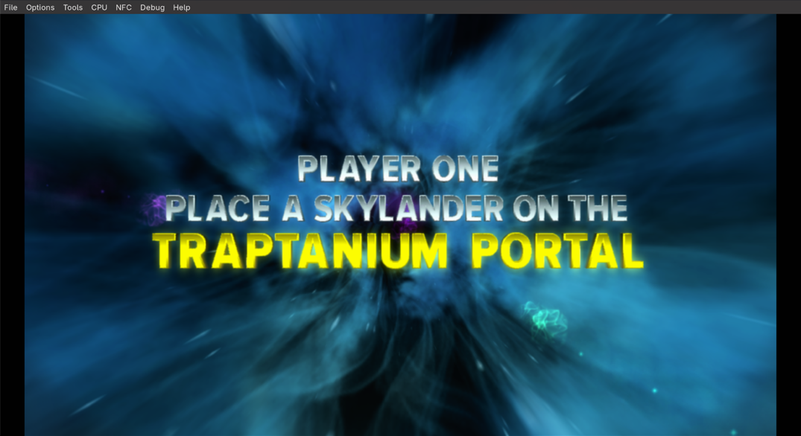
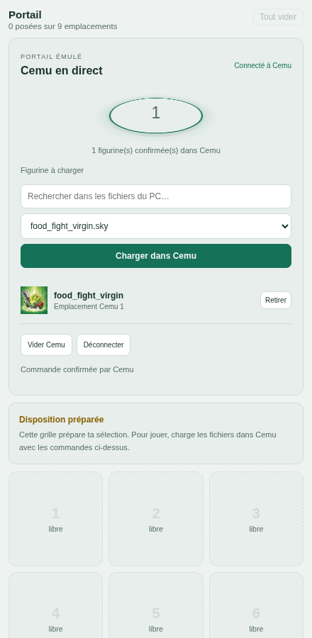

# Validation du pont portail — 13 septembre 2026

Environnement : Omarchy/Linux, Java 21, Cemu Debug construit avec la configuration
CMake présente, protocole v1. Commits de base et installation : [CEMU-PORTAL.md](CEMU-PORTAL.md).

Toutes les poses ont utilisé des copies dans `/tmp/cemu-portal-validation/figures`.
La configuration, le cache et le MLC de Cemu ont aussi été isolés sous ce dossier.
Le serveur de validation utilisait le port 18080 et une base PostgreSQL dédiée
`skylanders_portal_validation`, distincte de la base habituelle. Les secrets de
validation étaient temporaires et indépendants de l'ingestion.

## Vérifications automatisées

| Vérification | Résultat |
| --- | --- |
| Cemu non modifié : `cmake --build build -j 2` | Réussi, 531 étapes |
| Cemu avec patch, puis rebuild final | Réussi |
| Backend : Maven `verify -DskipFrontend=true` | Réussi, 49 tests, dont 5 nouveaux scénarios du service du pont |
| Frontend : `npm run build` | Réussi |
| Frontend : `node --test src/*.test.js` | 3 tests existants réussis |
| Connecteur : `python3 -m unittest discover -s connector -p 'test_*.py'` | 2 tests réussis : identité de fichier, traversée/symlinks, taille, expiration/session |
| Client local `connector/check_local.py` contre le vrai Cemu | Chargement, retrait, déduplication, révision périmée, session périmée, expiration, index invalide, fichier absent, hors racine, version incompatible : réussis |
| Dump de 1024 octets avec en-tête invalide | Refus `INVALID_DUMP` du vrai Cemu |
| API complète serveur/connecteur/Cemu | Pose Wildfire passée de `PENDING` à `APPLIED`, identité réelle observée |
| Authentification HTTP | Secret incorrect et échange des rôles navigateur/connecteur refusés avec 401 |
| Connecteur suspendu puis repris | Commande expirée, indisponibilité détectée, reconnexion sans rejeu ni pose tardive |
| Test Chromium headless contre serveur et vrai Cemu | Connexion, choix Food Fight, pose, confirmation, retrait : réussis ; aucune exception JavaScript |
| Affichage mobile | Pas de débordement horizontal à 375 px ; mouvements réduits activés |
| Démarrages/fermetures du binaire final | 3 cycles successifs réussis, socket supprimée à chaque fermeture |
| Lanceur `start_session.py` | Cemu et connecteur démarrés, serveur `READY`, connexion à une nouvelle epoch sans ancienne pose, arrêt à la fermeture de Cemu |

Les tests Chromium et de panne ont été exécutés par des scripts temporaires dans
`/tmp` avec les secrets lus depuis un fichier privé, sans les inscrire dans le dépôt.
Les tests unitaires et le client de vérification locale sont conservés dans le dépôt.

## Essais réellement effectués dans Trap Team

Jeu : `~/Games/Cemu/Skylanders - Trap Team (Europe) (En,Fr,De,Es,It,Nl,Sv,No,Da,Fi).wux`.

- Partie lancée sur une copie du MLC, portail activé par le pont.
- Pose de Food Fight par client local, sans ouvrir la fenêtre USB : la partie
  quitte l'attente du portail et reprend dans l'Académie.
- Retrait par client local : retour immédiat à « Place a Skylander on the
  Traptanium Portal ».
- Pose Wildfire depuis l'API serveur, transportée par le connecteur : chargement
  confirmé par Cemu et apparition de l'écran d'arrivée du personnage dans le jeu.
- Pose/retrait Food Fight depuis le test navigateur : commandes réellement
  exécutées par la même instance Cemu.

## Synchronisation avec la fenêtre native

Les actions natives ont été déclenchées via l'accessibilité GTK/AT-SPI :

- ouverture de « Emulated USB Devices » après la preuve sans fenêtre ;
- pose distante Food Fight : le champ natif affiche « Food Fight » ;
- bouton natif « Clear » : l'état du moteur, du connecteur et de l'API devient vide ;
- bouton natif « Load », fichier de test `buzzer_beak_storm_warning.sky` :
  l'API reçoit l'identité `212/12305` et le `fileId` du fichier exact ;
- retrait natif, puis fermeture normale de Cemu.

Le chargement natif du dump de piège vérifie le transport et la synchronisation,
**pas** le comportement du piège et de son vilain dans le jeu.

## Limites et incident observé

- Un lancement du binaire final sans jeu a produit un SIGSEGV avec une pile non
  exploitable. Aucun coredump système n'était disponible. Deux lancements sous
  GDB et trois cycles normaux suivants n'ont pas reproduit le crash. La cause
  n'est pas établie ; il ne faut pas présenter cet incident comme corrigé.
  Le lanceur sait récupérer une socket abandonnée par un crash.
- Pas de validation en jeu de Swap Force, des véhicules ou des pièges/vilains.
- Pas de test Windows/macOS, ni de qualification Release prolongée.
- Pas de test de saturation complète des 16 emplacements ni de panne d'écriture
  du disque pendant une sauvegarde Cemu. Les limites du format et le refus de
  chargement sont contrôlés, mais cela ne remplace pas ces essais.
- L'ingestion n'a pas été raccordée à la base de validation pour mesurer l'XP
  après ces essais. Son code n'a pas été modifié par le pont.

Le serveur et le connecteur ne déclarent jamais ces cas non vérifiés comme pris
en charge. Les fichiers habituels du joueur n'ont pas été modifiés par les tests.

## Interface directe — 14 septembre 2026

Cette évolution modifie le serveur et le frontend, sans changer le connecteur ni Cemu.
Le JAR contient désormais le portail direct 9 + piège ; la disposition historique n'est
pas rejouée. Vérifications effectuées :

- 59 tests Java réussis, dont 10 nouveaux tests `DirectPortalServiceTest` : indice Cemu
  distinct de la case graphique, pose confirmée sans déblocage, déplacement sans rechargement,
  remplacement séquentiel, échec du second chargement, reconnexion entre étapes, modification
  native concurrente, choix de copie exact, refus d'une requête d'une autre fenêtre périmée,
  occupants hors grille, vidage et expiration sans rejeu.
- Tests frontend existants (`node --test src/*.test.js`) réussis et build Vite réussi.
- Chromium sans interface visible, avec les vrais assets compilés et des réponses HTTP
  contrôlées : six résultats en deux rangées de trois, clic sur image, dépôt sur la case 7,
  absence de pose optimiste, retrait depuis une deuxième fenêtre, partage de la connexion,
  choix d'une copie exacte depuis l'autre fenêtre, piège placé dans la serrure, vidage sans
  confirmation et absence de rejeu à la reconnexion. Script reproductible :
  `tools/check_direct_portal_ui.cjs` (Playwright fourni par `PLAYWRIGHT_MODULE`, Chromium par
  `CHROMIUM_PATH`, défaut `/bin/chromium`). Ce test ne contacte aucun Cemu ni fichier `.sky`.

Ces contrôles automatisés ne constituent pas un nouvel essai en jeu de cette interface.
Les essais Cemu/Trap Team précédents sont décrits dans les sections datées ci-dessus ; la
reconnaissance en jeu des pièges, assemblages Swap Force et véhicules conserve ses limites
précédentes. Aucun fichier de figurine de la session utilisateur n'a été modifié pour ces tests.
